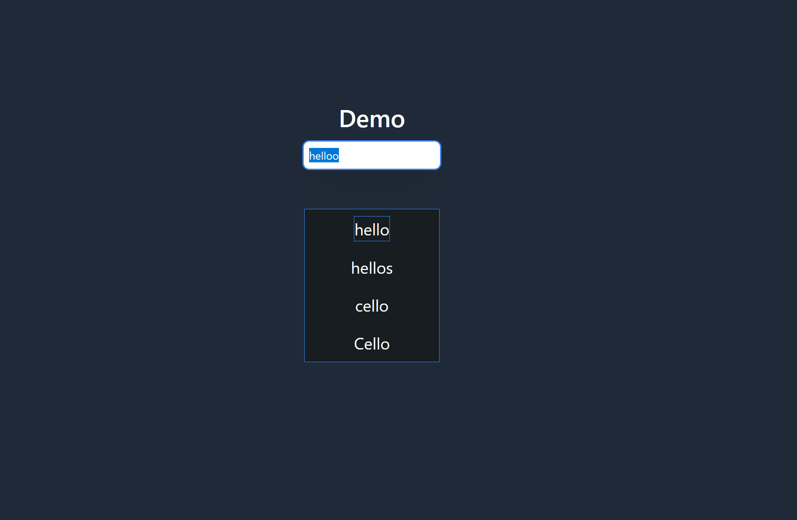

# Browser Extension for Spell Checking

This browser extension integrates Typo.js for spell checking within text inputs on web pages using a keyboard shortcut, <code>Ctrl</code>+<code>Space</code> by default. The shortcut will open a menu with suggested words if the word is misspelled.

## Features

- **Spell Checking**: Automatically checks the spelling of the word to the left of the cursor in text input fields and `contenteditable` areas.
- **Suggestions Menu**: Displays a menu with up to 4 spelling suggestions for the identified word.
- **Easy Navigation**: Navigate through the suggestions with intuitive keys (`j` and `k`) and select a word for replacement.
- **Contenteditable Support**: Works with rich text editors using `contenteditable` elements, in addition to standard text inputs and text areas.
- **Privacy First**: No data is sent anywhere—all processing is done locally in your browser.

## How to Use

1. **Trigger Spell Check**: Place the cursor to the right of a word in a text input field or `contenteditable` element. Press <code>Ctrl</code>+<code>Space</code> to check the spelling of that word.
2. **Navigate Suggestions**: If there are spelling suggestions, they will be displayed in a menu at the center of the screen. Use the following keys to navigate:
    - <code>j</code>: Move down through the list of suggestions.
    - <code>k</code>: Move up through the list of suggestions.
3. **Select a Suggestion**: To replace the word with a selected suggestion, navigate to the desired suggestion using <code>j</code> and <code>k</code>, then press <code>Space</code>, <code>Enter</code>, or <code>Tab</code> to select it. Press <code>Esc</code> to close the menu.

## Troubleshooting
- **Not Working in Certain Input Fields**: There are a couple of cases where the add-on may not work:
    1. If the website's input field Content Security Policy (CSP) doesn't allow it.

## Additional Information
- **Privacy**: The extension processes text entirely within your browser. No data is ever sent to any external servers.

